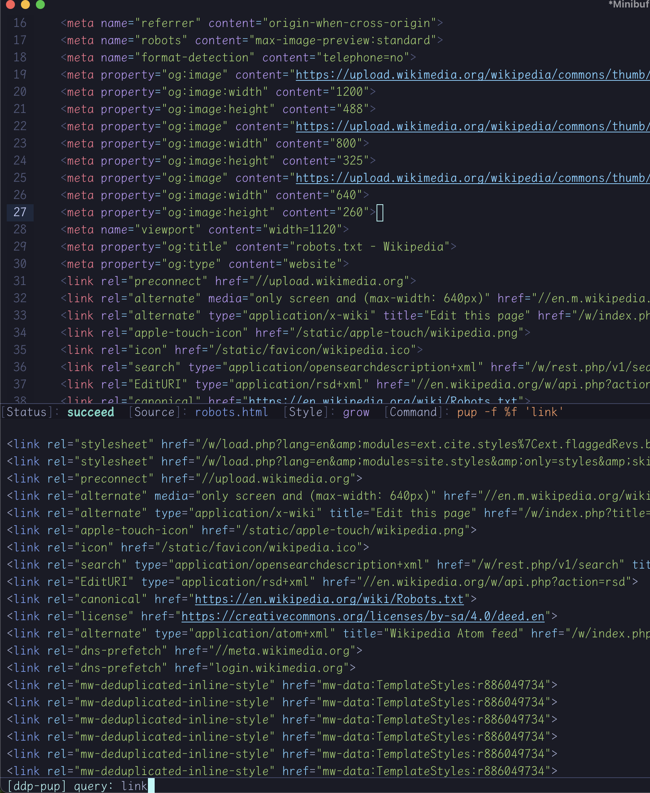
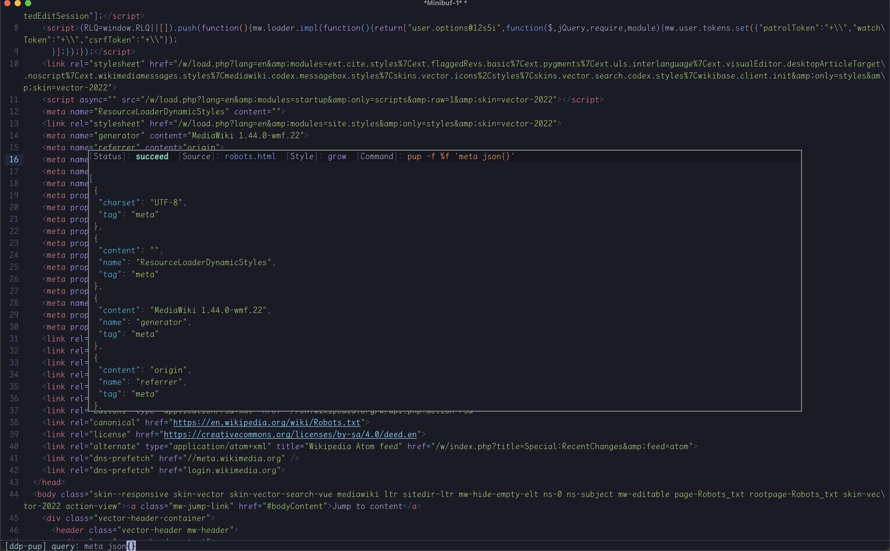

# ddp

[](LICENSE)
[](http://melpa.org/#/ddp)

A Dynamic Data Processor for Emacs, providing interactive commands to filter content using command-line tools like `yq`, `jq`, `pup`, `dasel` etc.

<!-- md-toc start - Don't edit this section. Run M-x md-toc-update -->

**Table of Contents**

- [ddp](#ddp)
   - [Screenshot](#screenshot)
   - [Install](#install)
      - [dependencies](#dependencies)
      - [package](#package)
   - [Features](#features)
   - [Usage](#usage)
      - [options](#options)
      - [ddp-define-command](#ddp-define-command)
      - [Examples](#examples)
      - [Keybindings](#keybindings)

<!-- md-toc end -->

## Screenshot

Using window:



Using posframe:



## Install

### dependencies

- **Emacs 29.1 or later**.

### package

- **Manually**

Clone this repository and add it to your `load-path`, then require the package in your Emacs init file:

```elisp
(add-to-list 'load-path "/path/to/ddp")
(require 'ddp)
```

- **MELPA**
   
M-x `package-install RET ddp RET`

## Features

- Asynchronous Processing
- Support ANSI colors
- support file, buffer, region as source

## Usage

The ddp package provides a framework to define interactive commands for processing data with command-line tools.
It opens a minibuffer for query input, shows results in a bottom side window, and supports history and keybindings.

### options

- `ddp-debounce-delay`: default delay for debouncing

- `ddp-display-method`: default display method, window or posframe

- `ddp-display-style`: default height style, fixed, fit or grow

- `ddp-height-range`: default height range, (MIN . MAX)

### ddp-define-command

```elisp
(ddp-define-command "NAME"
  "Parse data using NAME."
  :url "https://github.com/NAME"
  :exec "name"
  :cmd "%e -P -C -p %r -o %w %f %q"
  :ansi t
  :support ("yaml" "json" "toml"))
```

EXPLAINATION:

 - `:exec`: required, a string represents executable binary or its path.
 - `:cmd` : required, a string contains placeholders for substitution with properties in `ddp-plist`.
    - `%e`: `:exec`, executable command
    - `%q`: `:query`, selector string, to extract specific part from whole text
    - `%f`: `:file`, selected file, temp file is created when no file provided.
    - `%r`: `:read`, input format, detected by customization or default function
    - `%w`: `:write`, output format, detected by customization or default function
 - `:url`: optional,  a url to show help info when error occurs
 - `:delay`: optional, a number to set debounce delay per command
 - `:ansi`: optional, boolean to handle ansi output, usually used with --color option
 - `:mode`: optional, major mode for output, usually used when exec do not support ansi
 - `:method`: optional, a symbol  to set display method per command
 - `:style`: optional, a symbol to set display height style per command
 - `:support`: optional, a list of formats the exec supports
 - `:pred`: optional, an alist of customized functions to set :read, :write,:mode dynamically
 - `:bind`: optional, an alist of keybindings pair to bind customized commands per command

### Examples

- `ddp-yq`: Parse YAML files or buffers with [yq](https://github.com/mikefarah/yq)
```elisp
(ddp-define-command "yq"
  "Parse data using yq."
  :url "https://github.com/mikefarah/yq"
  :ansi t
  :exec "yq"
  :cmd "%e -P -C -p %r -o %w %f %q"
  :support ("yaml" "json" "toml" "xml" "tsv" "csv" "props" "lua" "base64"))
```

- `ddp-jq`: Parse JSON files or buffers with [jq](https://github.com/jqlang/jq)

```elisp
(ddp-define-command "jq"
  "Parse json using jq."
  :url "https://github.com/jqlang/jq"
  :exec "jq"
  :cmd "%e -C %q %f"
  :ansi t)
```

- `ddp-pup`: Parse HTML files or buffers with [pup](https://github.com/gromgit/pup)

`pup` output different formats according to function called in the query end.

```elisp
(defun ddp-pup-pred ()
  "Detect major mode for `ddp-pup' output based on query."
  (pcase (ddp--get :query)
    ((pred (string-suffix-p "json{}")) 'js-json-mode)
    ((pred (string-suffix-p "text{}")) 'text-mode)
    (_ 'html-mode)))

(ddp-define-command "pup"
  "Parse html using pup."
  :url "https://github.com/gromgit/pup"
  :exec "pup"
  :cmd "%e -f %f %q"
  :pred ((mode . ddp-pup-pred)))
```

- `ddp-dasel`: Parse multiple formats with [dasel](https://github.com/TomWright/dasel)

```elisp
(ddp-define-command "dasel"
  "Parse data using dasel."
  :url "https://github.com/TomWright/dasel"
  :ansi t
  :exec "dasel"
  :cmd "%e --colour -f %f -r %r -w %w -s %q"
  :support ("yaml" "json" "toml" "csv" "xml"))
```

### Keybindings

Provide default keybindings as follow:

- `C-c c`: ddp-copy-output
- `C-c s`: ddp-save-output
- `C-c k`: ddp-clear-query
- `C-c m`: ddp-modify-cmd
- `C-c w`: ddp-cycle-output-format
- `C-c y`: ddp-copy-as-shell-command
- `C-c t`: ddp-toggle-display-method
